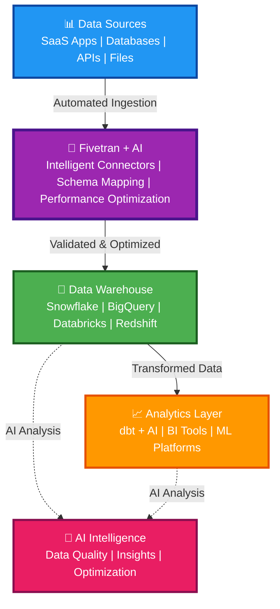

# Partnering with Fivetran: AI-Powered Data Intelligence for the Modern Data Stack

## Transform Your Data Infrastructure with AI

Fivetran's AI-powered solutions revolutionize how enterprises manage, analyze, and derive value from their data. By integrating intelligent automation throughout your Modern Data Stack, we deliver measurable ROI, operational efficiency, and competitive advantage.

## The Value of AI-Enhanced Data Pipelines

### Accelerate Time-to-Value
- **Faster connector setup** through intelligent configuration and validation
- **Reduction in analytics development time** with automated dbt model generation
- **Faster time-to-insight** through AI-driven data intelligence

### Reduce Operational Overhead
- **Reduction in operational complexity** with unified automation
- **Infrastructure cost savings** through intelligent resource optimization
- **Improvement in data quality** via automated quality assessment

### Enable Strategic Decision-Making
- Proactive anomaly detection and issue resolution
- AI-driven business insights and trend analysis
- Automated recommendations for data optimization

## Fivetran + AI: Integrated into Every Modern Data Stack

### The Modern Data Stack Architecture

## Why Partner with Fivetran for AI Solutions?

### Enterprise-Grade Intelligence
Our AI solutions are built specifically for enterprise environments, ensuring security, scalability, and reliability at every level. With 99.9% uptime and support for 740+ connector types, we deliver the performance your business demands.

### Seamless Integration
Fivetran's AI solutions integrate seamlessly with your existing Modern Data Stack—no rip-and-replace required. Our intelligent automation works alongside your current tools, enhancing their capabilities without disrupting workflows.

### Future-Proof Architecture
Built on modern, scalable architectures with containerization, and cloud-native design. Our solutions grow with your business, adapting to changing data volumes and requirements.

## Getting Started

Partnering with Fivetran means gaining access to:
- **Intelligent automation** that reduces manual work
- **Proactive insights** that prevent issues before they impact your business
- **Expert support** from our professional services team
- **Continuous innovation** as we evolve our AI capabilities

Transform your data infrastructure today. [Contact](https://go.fivetran.com/demo/services) us to learn how Fivetran's AI solutions can accelerate your Modern Data Stack journey.

---

*Fivetran: Where AI meets enterprise data infrastructure to deliver unprecedented value and automation.*

