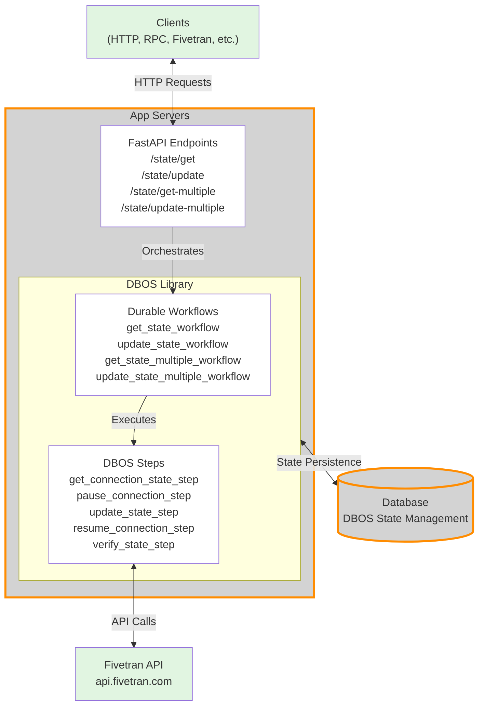

# Fivetran State Manager: Architecture

## Architecture Overview

This diagram illustrates the architecture of the Fivetran Connection State Manager:

1. **Clients**: External systems making HTTP requests (including Fivetran itself)
2. **App Servers**: FastAPI application with REST endpoints for state management
3. **DBOS Library**: 
   - **Durable Workflows**: Orchestrate multi-step operations with automatic recovery
   - **DBOS Steps**: Individual atomic operations that interact with Fivetran API
4. **Fivetran API**: External service for managing connection state
5. **Database**: DBOS-managed database for workflow state persistence and durability

The architecture ensures reliable state management through DBOS's durable execution model, where workflows can recover from failures and maintain consistency.
