# HVR API Client Tool

A comprehensive Python client for interacting with HVR (High Volume Replicator) APIs. This tool provides easy-to-use methods for managing HVR hubs, channels, locations, and data replication workflows.

## 🏗️ Architecture Overview

```mermaid
graph TB
    %% User Interfaces and Entry Points
    subgraph "User Interfaces"
        CLI[Command Line Interface]
        IDE[IDE Integration<br/>VS Code, PyCharm]
        REPL[Python REPL]
        CI[CI/CD Pipelines]
    end

    %% Core Application Layer
    subgraph "HVR API Client Tool"
        direction TB
        Auth[Authentication Manager<br/>Token Management]
        Client[HVRAPIClient<br/>Core API Interface]
        
        subgraph "Core Methods"
            ChannelMgmt[Channel Management<br/>CRUD Operations]
            HubMgmt[Hub Management<br/>State Control]
            DataOps[Data Operations<br/>Refresh & Monitoring]
        end
        
        subgraph "Workflow Automation"
            Migration[Environment Migration]
            Backup[Configuration Backup]
            Monitoring[Real-time Monitoring]
            BatchOps[Batch Operations]
        end
        
        subgraph "Validation & Extensions"
            Validation[Config Validation]
            Extensions[Custom Extensions]
            ErrorHandling[Error Handling]
        end
    end

    %% Configuration and Data Layer
    subgraph "Configuration Layer"
        Config[config.json<br/>Credentials & Settings]
        BackupFiles[Backup Files<br/>JSON Configurations]
        Templates[Channel Templates]
    end

    %% HVR Infrastructure
    subgraph "HVR Infrastructure"
        direction TB
        HVRHub[HVR Hub<br/>Central Management]
        
        subgraph "Channels & Locations"
            Channels[Channels<br/>Data Pipelines]
            Locations[Locations<br/>Source & Target]
            Tables[Tables<br/>Data Objects]
        end
        
        subgraph "Data Flow"
            Capture[Capture Actions<br/>Data Extraction]
            Integrate[Integrate Actions<br/>Data Loading]
            Refresh[Refresh Jobs<br/>Data Synchronization]
        end
    end

    %% External Systems
    subgraph "External Systems"
        SourceDB[(Source Databases<br/>Oracle, SQL Server, etc.)]
        TargetDB[(Target Databases<br/>Data Warehouses)]
        CloudStorage[(Cloud Storage<br/>S3, Azure, GCP)]
    end

    %% Data Flow Connections
    CLI --> Client
    IDE --> Client
    REPL --> Client
    CI --> Client
    
    Client --> Auth
    Auth --> Config
    Client --> ChannelMgmt
    Client --> HubMgmt
    Client --> DataOps
    
    ChannelMgmt --> Migration
    HubMgmt --> Monitoring
    DataOps --> Backup
    
    Migration --> Validation
    Backup --> BackupFiles
    Monitoring --> Extensions
    
    Client --> HVRHub
    HVRHub --> Channels
    HVRHub --> Locations
    Channels --> Tables
    
    Channels --> Capture
    Channels --> Integrate
    DataOps --> Refresh
    
    Capture --> SourceDB
    Integrate --> TargetDB
    Refresh --> CloudStorage

    %% Styling
    classDef userInterface fill:#e1f5fe,stroke:#01579b,stroke-width:2px
    classDef coreComponent fill:#f3e5f5,stroke:#4a148c,stroke-width:2px
    classDef workflow fill:#e8f5e8,stroke:#1b5e20,stroke-width:2px
    classDef config fill:#fff3e0,stroke:#e65100,stroke-width:2px
    classDef hvrInfra fill:#fce4ec,stroke:#880e4f,stroke-width:2px
    classDef external fill:#f1f8e9,stroke:#33691e,stroke-width:2px

    class CLI,IDE,REPL,CI userInterface
    class Auth,Client,ChannelMgmt,HubMgmt,DataOps coreComponent
    class Migration,Backup,Monitoring,BatchOps,Validation,Extensions,ErrorHandling workflow
    class Config,BackupFiles,Templates config
    class HVRHub,Channels,Locations,Tables,Capture,Integrate,Refresh hvrInfra
    class SourceDB,TargetDB,CloudStorage external
```



## 🎯 What This Tool Solves

The HVR API Client Tool addresses common challenges in data replication and ETL workflows:

### **Existing Use Cases You Can Automate:**
- **Environment Migration**: Copy channels from dev to staging to production with environment-specific configurations
- **Disaster Recovery**: Automated backup and restoration of channel configurations
- **Maintenance Windows**: Safe hub freezing/unfreezing for system maintenance
- **Data Refresh Orchestration**: Automated data refresh workflows with monitoring
- **Multi-Environment Deployment**: Deploy the same channel across multiple environments with different source/target locations
- **Configuration Management**: Version control and backup of channel configurations
- **Batch Operations**: Perform operations across multiple channels simultaneously
- **Monitoring & Alerting**: Real-time monitoring of data replication jobs

### **New Possibilities This Tool Enables:**
- **Infrastructure as Code**: Define channel configurations in code for consistent deployments
- **CI/CD Integration**: Automate channel deployment as part of your data pipeline
- **Self-Service Data Operations**: Enable data teams to manage their own replication workflows
- **Multi-Cloud Replication**: Manage data replication across different cloud platforms
- **Compliance Automation**: Automated backup and audit trail generation
- **Performance Optimization**: Automated channel tuning and optimization
- **Data Lineage Tracking**: Track data flow across multiple channels and environments
- **Cost Optimization**: Automated channel lifecycle management to optimize costs

### **Who Benefits:**
- **Data Engineers**: Automate repetitive channel management tasks
- **DevOps Teams**: Integrate HVR operations into CI/CD pipelines
- **Data Architects**: Standardize channel configurations across environments
- **Platform Teams**: Build self-service data replication capabilities
- **Compliance Teams**: Automate audit and backup processes
- **Business Users**: Enable self-service data refresh operations

## 🚀 Quick Start

### Prerequisites
- Python 3.8+
- Access to an HVR hub
- Valid HVR credentials

### Installation
1. Clone or download the `hvr_api_frame.py` file
2. Install required dependencies:
```bash
pip install requests urllib3
```

### Configuration
Create a `config.json` file in your working directory:
```json
{
  "fivetran": {
    "username": "your_hvr_username",
    "password": "your_hvr_password", 
    "base_url": "https://your-hvr-server:4341/"
  }
}
```

### Test From the Terminal (CLI)

Follow these steps to run and test the framework from your shell:

1. Create and activate a virtual environment (recommended):
```bash
python3 -m venv .venv && source .venv/bin/activate
```

2. Install dependencies:
```bash
pip install requests urllib3
```

3. Ensure your `config.json` exists at `path_to/hvr_folder/config.json` (default path used by the script). If your file is elsewhere, update the `r` variable in `hvr_api_frame.py` accordingly.

4. Run the client end-to-end:
```bash
python /path_to/hvr_api_frame.py
```

5. Optional: Run with warnings suppressed for self-signed TLS (already disabled in code), and with debug logs:
```bash
PYTHONWARNINGS="ignore:Unverified HTTPS request" python -X dev /path_to/hvr_api_frame.py
```

6. Try interactive testing in a Python REPL:
```bash
python
```
```python
import json
from hvr_api_frame import HVRAPIClient, test_authentication

cfg = json.load(open('path_to/hvr_folder/config.json'))
token = test_authentication(cfg['fivetran']['username'], cfg['fivetran']['password'], cfg['fivetran']['base_url'])
client = HVRAPIClient(cfg['fivetran']['base_url'], cfg['fivetran']['username'], cfg['fivetran']['password'], token)

print(client.get_hub_status('hvrhub'))
```

7. Run specific use cases by uncommenting blocks in `hvr_api_frame.py` (e.g., hub freeze/unfreeze, refresh-and-poll). Then re-run step 4.

8. Common CLI issues:
- 401/403: verify credentials and permissions in `config.json`.
- 404: check hub, channel names, or base URL in `config.json`.
- Network/TLS: confirm host/port reachability and certificates.

## 📖 Use Cases

### Use Case 1: Channel Migration with Changes

**Scenario**: You want to create a new channel based on an existing one, but with modifications for a different environment.

```python
# Get details from existing channel
channel_details = client.get_channel_details("source_channel")

# Modify the configuration
channel_config = channel_details
channel_config['channel'] = "new_channel_name"

# Configure extract-to-import setup
channel_config['actions'] = [
    {
        'type': 'Capture',
        'loc_scope': 'source_location',
        'table_scope': '*'
    },
    {
        'type': 'Integrate', 
        'loc_scope': 'target_location',
        'table_scope': '*'
    }
]

# Create the new channel
new_channel = client.create_channel(channel_config)
print(f"✅ Channel '{new_channel_name}' created successfully!")
```

**What this does:**
- Copies an existing channel configuration
- Updates the channel name
- Configures proper extract-to-import actions
- Creates a new channel with the modified setup

### Use Case 2: Hub Monitoring and Management

**Scenario**: You need to monitor hub status and manage its state (freeze/unfreeze) for maintenance.

```python
# Check hub status
hub_status = client.get_hub_status(hub="hvrhub")
print(f"Hub State: {hub_status.get('Hub_State')}")

# Freeze hub for maintenance
if hub_status.get('Hub_State') == 'LIVE':
    print("🔄 Freezing hub for maintenance...")
    client.post_hub_update(hub="hvrhub")
    
    # Verify the change
    updated_status = client.get_hub_status(hub="hvrhub")
    print(f"New Hub State: {updated_status.get('Hub_State')}")

# Unfreeze hub after maintenance
print("🔄 Unfreezing hub...")
client.post_hub_startv2(hub="hvrhub")
```

**What this does:**
- Monitors current hub state
- Safely freezes hub for maintenance
- Unfreezes hub when ready
- Provides status verification

### Use Case 3: Data Refresh and Monitoring

**Scenario**: You want to trigger a data refresh and monitor its progress until completion.

```python
# Start a refresh job
refresh_response = client.start_refresh_job(
    hub="hvrhub",
    channel="my_channel"
)

if refresh_response:
    event_id = refresh_response.get('posted_ev_id')
    print(f"🔄 Refresh job started with Event ID: {event_id}")
    
    # Monitor the job progress
    results = client.poll_refresh_job(
        hub="hvrhub",
        channel="my_channel", 
        event_id=event_id,
        timeout=1800,  # 30 minutes
        poll_interval=30  # Check every 30 seconds
    )
    
    if results:
        print("✅ Refresh completed successfully!")
        print(f"Tables processed: {len(results.get('results', []))}")
    else:
        print("❌ Refresh failed or timed out")
```

**What this does:**
- Initiates a data refresh job
- Monitors job progress in real-time
- Provides detailed completion status
- Handles timeouts and errors gracefully

## 🛠️ Core Methods Reference

### Channel Management
- `get_channel_details(channel_name)` - Get full channel configuration
- `create_channel(channel_config)` - Create new channel
- `update_channel(channel_name, channel_config)` - Update existing channel
- `delete_channel(channel_name)` - Delete channel
- `get_all_channel_names()` - List all channels

### Hub Management
- `get_hub_status(hub)` - Get hub status and properties
- `post_hub_update(hub)` - Freeze hub
- `post_hub_startv2(hub)` - Unfreeze hub
- `manage_hub_state(hub, hub_id)` - Smart hub state management

### Data Operations
- `start_refresh_job(hub, channel)` - Start data refresh
- `poll_refresh_job(hub, channel, event_id)` - Monitor refresh progress
- `execute_comprehensive_refresh(hub, channel)` - Complete refresh workflow

## 🔧 Extending the Tool

### Adding New Methods

The tool is designed to be easily extensible. Here's how to add new functionality:

#### 1. Add New API Methods
```python
def get_table_details(self, channel_name: str, table_name: str) -> Dict:
    """
    Get details of a specific table in a channel.
    """
    url = f"{self.base_url}/api/v6.1.0.36/hubs/hvrhub/definition/channels/{channel_name}/tables/{table_name}"
    response = requests.get(url, headers=self._get_auth_headers(), verify=False)
    response.raise_for_status()
    return response.json()
```

#### 2. Create Workflow Methods
```python
def backup_channel_config(self, channel_name: str) -> str:
    """
    Backup a channel configuration to a JSON file.
    """
    config = self.get_channel_details(channel_name)
    backup_file = f"backup_{channel_name}_{time.strftime('%Y%m%d_%H%M%S')}.json"
    
    with open(backup_file, 'w') as f:
        json.dump(config, f, indent=2)
    
    return backup_file
```

#### 3. Add Validation Methods
```python
def validate_channel_config(self, channel_config: Dict) -> List[str]:
    """
    Validate channel configuration and return list of issues.
    """
    issues = []
    
    if 'channel' not in channel_config:
        issues.append("Missing channel name")
    
    if 'actions' not in channel_config:
        issues.append("Missing actions configuration")
    
    # Check location references
    for action in channel_config.get('actions', []):
        if 'loc_scope' not in action:
            issues.append(f"Action missing loc_scope: {action}")
    
    return issues
```

### Best Practices for Extensions

1. **Error Handling**: Always include proper error handling:
```python
try:
    response = requests.get(url, headers=self._get_auth_headers(), verify=False)
    response.raise_for_status()
    return response.json()
except requests.exceptions.HTTPError as e:
    print(f"HTTP error: {e}")
    return None
```

2. **Logging**: Add informative logging:
```python
print(f"🔧 Executing {method_name} for {target}")
print(f"📊 Results: {json.dumps(results, indent=2)}")
```

3. **Configuration**: Make methods configurable:
```python
def custom_method(self, param1: str, param2: str = "default", timeout: int = 30):
    # Method implementation
    pass
```

## 🎯 Advanced Use Cases

### Automated Channel Deployment
```python
def deploy_channel_pipeline(self, source_channel: str, target_name: str, locations: Dict):
    """
    Automated channel deployment pipeline.
    """
    # 1. Backup original
    backup_file = self.backup_channel_config(source_channel)
    
    # 2. Create new channel
    config = self.get_channel_details(source_channel)
    config['channel'] = target_name
    
    # 3. Update locations
    config['actions'] = [
        {'type': 'Capture', 'loc_scope': locations['source'], 'table_scope': '*'},
        {'type': 'Integrate', 'loc_scope': locations['target'], 'table_scope': '*'}
    ]
    
    # 4. Validate and create
    issues = self.validate_channel_config(config)
    if issues:
        print(f"❌ Validation issues: {issues}")
        return False
    
    new_channel = self.create_channel(config)
    print(f"✅ Channel '{target_name}' deployed successfully!")
    return True
```

### Batch Operations
```python
def batch_channel_operation(self, channels: List[str], operation: str):
    """
    Perform operations on multiple channels.
    """
    results = {}
    
    for channel in channels:
        try:
            if operation == "backup":
                results[channel] = self.backup_channel_config(channel)
            elif operation == "freeze":
                # Add freeze logic
                pass
            print(f"✅ {operation} completed for {channel}")
        except Exception as e:
            results[channel] = f"Error: {e}"
            print(f"❌ {operation} failed for {channel}: {e}")
    
    return results
```

## 🚨 Troubleshooting

### Common Issues

1. **Authentication Errors**
   - Verify credentials in `config.json`
   - Check if access token is expired
   - Ensure proper permissions

2. **404 Errors**
   - Verify hub name exists
   - Check API endpoint URLs
   - Ensure channel names are correct

3. **Location Reference Errors**
   - Verify locations exist in hub
   - Check location group naming (must be uppercase)
   - Ensure proper action configuration

### Debug Mode
Enable detailed logging by adding:
```python
import logging
logging.basicConfig(level=logging.DEBUG)
```

### IDE Setup and Debugging

Run and debug `hvr_api_frame.py` from your preferred IDE.

#### VS Code
1. Open the folder: `path_to/hvr_folder/`.
2. Select the Python interpreter for your project (bottom-right status bar) or run:
   - Command Palette → "Python: Select Interpreter" → choose `.venv` if created.
3. Create a run configuration (if not auto-created):
   - Run and Debug → create `launch.json` for Python with:
```json
{
  "version": "0.2.0",
  "configurations": [
    {
      "name": "Run HVR API Client",
      "type": "python",
      "request": "launch",
      "program": "/path_to/hvr_folder/hvr_api_frame.py",
      "console": "integratedTerminal",
      "cwd": "/path_to/hvr_folder/hvr",
      "env": {
        "PYTHONWARNINGS": "ignore:Unverified HTTPS request"
      }
    }
  ]
}
```
4. Set breakpoints in `hvr_api_frame.py` (e.g., near `test_authentication`, `get_hub_status`).
5. Click Run to debug.

#### PyCharm
1. Open the project directory: `path_to/hvr_folder/`.
2. Configure Python interpreter (Project Settings → Python Interpreter) and install `requests`, `urllib3`.
3. Create a Run/Debug Configuration:
   - Script path: `path_to/hvr_folder/hvr_api_frame.py`
   - Working directory: `path_to/hvr_folder`
   - Environment variables (optional): `PYTHONWARNINGS=ignore:Unverified HTTPS request`
4. Set breakpoints and Run/Debug.

#### Running Specific Workflows in IDE
- Uncomment the relevant "Use Case" blocks in `hvr_api_frame.py` (e.g., hub status/freeze/unfreeze, refresh and poll).
- Update channel names, locations, or hub names inline as needed.
- Re-run your configuration to execute only those scenarios.

## 📚 Additional Resources

- HVR API Documentation
- HVR Best Practices Guide
- Python Requests Library Documentation

## 🤝 Contributing

Feel free to extend this tool with additional functionality:
1. Add new API methods
2. Create workflow automation
3. Improve error handling
4. Add unit tests

---

**Happy HVR API Development! 🚀**
