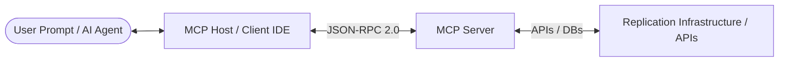
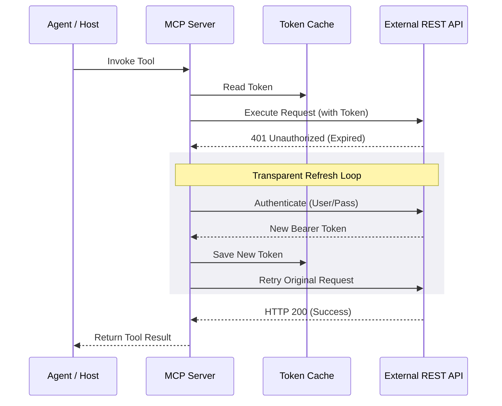
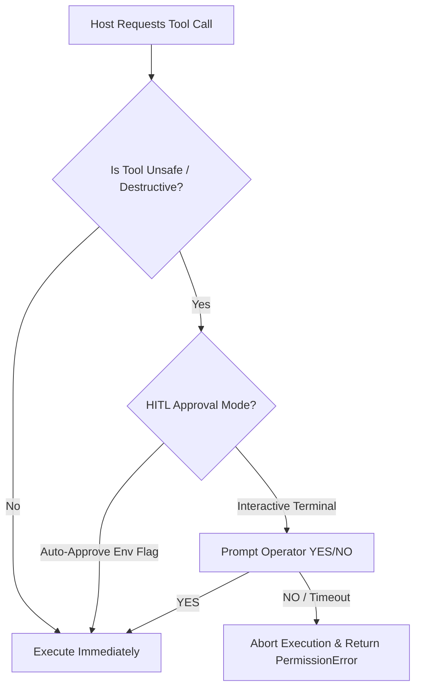

# Model Context Protocol (MCP) guide

This guide covers architecture, security, and integration best practices for adopting the **Model Context Protocol (MCP)**. It serves as an educational framework for designing, implementing, and orchestrating MCP servers within both local and hosted environments.

---

## 1. System architecture & transport protocols

MCP is an open standard that enables Large Language Models (LLMs) to interact securely with external data, systems, and APIs. It operates on a client-server-host architecture:



### Transport options

When deploying MCP, select the transport protocol that aligns with your execution model:

| Transport | Connection mechanism | best used | Architecture considerations |
| :--- | :--- | :--- | :--- |
| **Stdio (Standard Input/Output)** | Parent process spawns server process; JSON-RPC 2.0 messages are exchanged via `stdin` and `stdout`. | Local development, desktop IDEs (e.g., Cursor, Claude Desktop, VS Code), containerized execution. | Server logs must be written to `stderr` to avoid corrupting the JSON-RPC communication stream on `stdout`. |
| **SSE (Server-Sent Events)** | Host connects to server via HTTP; receives unidirectional server events and posts commands back. | Remote services, multi-tenant agent platforms, enterprise API integration. | Requires a persistent HTTP daemon (e.g., using `FastAPI` or `starlette` beneath the FastMCP server). |

---

## 2. Server definition & design patterns

MCP servers should be designed to act as lightweight, stateless translators between LLM intents and underlying APIs. 

### Core design rules
* **Stateless operation:** State should be managed by the underlying API or database rather than inside the MCP server memory.
* **Singleton client pattern:** Instantiate the core API client once during server boot. Avoid reinstantiating clients on every tool call.
* **Fallback config paths:** Establish a robust cascade for credential discovery to ensure portability across local dev, Docker, and production hosts:
  1. Primary path (e.g., explicit workspace file `/config.json`)
  2. Local environment folder (`./config.json`)
  3. Parent workspace folder (`../config.json`)
  4. Environment variables (highest priority for CI/CD and containers)

---

## 3. Tool design
Tools are the executable functions exposed by the MCP server. Since LLMs evaluate tool definitions dynamically to choose when and how to call them, proper schema design is critical.

### Semantic naming and descriptions
* **Verbose docstrings:** Write clear, conversational descriptions explaining *why* and *when* the LLM should invoke the tool.
* **Precise type annotations:** Annotate every argument with explicit types (`str`, `int`, `bool`, `List[str]`).
* **Structured parameters:** Prefer standard JSON structures or strict parameter lists. If complex arrays or objects are needed, specify their shape in the description or parameter schema.

### Idempotency & destructive actions
* **Read-Only vs. write separation:** Visually or structurally differentiate safe lookup tools (e.g., `get_*`, `list_*`) from state-changing tools (e.g., `create_*`, `delete_*`).
* **Idempotent operations:** Design write tools to check existing state before execution to prevent double-submissions or duplicate records.

---

## 4. Authentication & token management

Secure API endpoints must be protected behind authentication barriers, but LLM agents cannot be expected to manage session lifetimes.



### Token lifecycles
> [!IMPORTANT]
> **Transparent token auto-refresh**
> Implement a fallback error wrapper inside the server's HTTP request client. If the target API returns an HTTP 401 Unauthorized, intercept the response, call the auth endpoint to acquire a new token, cache it, and transparently retry the user's request. This prevents session interruptions for the host agent.

* **Disable insecure warnings selectively:** If working with local/on-premise certificates, disable SSL warnings via `urllib3.disable_warnings()` but output warnings strictly to `sys.stderr` to keep `stdout` clear for protocol frames.

---

## 5. Human-in-the-Loop (HITL) gateways

To protect critical infrastructure, sensitive data, or high-cost operations, implement a Human-in-the-Loop (HITL) authorization gateway.



### HITL implementation rules
1. **Classify action tiers:** Group tools into:
   * *Safe/Read-only:* (`get_status`, `list_records`) -> No approval needed.
   * *Modifying/Creation:* (`create_resource`, `update_schema`) -> Interactive approval requested.
   * *Destructive:* (`delete_resource`, `stop_services`) -> Mandated interactive approval.
2. **Interactive prompts:** Pause execution using synchronous input readers (`input()`) executing within an async runner. Trigger a terminal bell (`\a`) to physically alert the operator.
3. **Automated bypass (CI/CD):** Always provide an environment override flag (e.g., `AUTO_APPROVE=true`) to bypass interactive blocking when running inside cron jobs, pipelines, or background test suites.

---

## 6. Change management & deployment

Deploying updates to live MCP servers requires careful coordination to prevent breaking the calling LLM's state.

### Testing tools & protocol verification

#### Zero-dependency JSON-RPC testing
You can test Stdio-based servers directly from the terminal by passing raw JSON-RPC handshakes through standard input:
```bash
(echo '{"jsonrpc":"2.0","id":1,"method":"initialize","params":{"protocolVersion":"2024-11-05","capabilities":{},"clientInfo":{"name":"tester","version":"1.0"}}}'; echo '{"jsonrpc":"2.0","method":"notifications/initialized"}'; echo '{"jsonrpc": "2.0", "method": "tools/list", "params": {}, "id": 2}') | python3 path/to/server.py
```

#### MCP inspector
Utilize the official protocol graphical debugger to interactively test tool payloads:
```bash
npx -y @modelcontextprotocol/inspector python3 path/to/server.py
```

---

## 7. Agentic workflow orchestration

While individual tool calls are helpful, the true power of MCP lies in coordinating multiple tools to accomplish high-level agentic goals.

### Multi-Tool execution loop
To run complex workflows programmatically outside an IDE, write an orchestration script that connects as an MCP Client and handles step-by-step logic.

```python
import asyncio
from mcp import ClientSession, StdioServerParameters
from mcp.client.stdio import stdio_client

async def run_orchestration():
    server_params = StdioServerParameters(command="python3", args=["server.py"])
    
    # Establish connection
    async with stdio_client(server_params) as (read, write):
        async with ClientSession(read, write) as session:
            await session.initialize()
            
            # Step 1: Query environment status
            status_res = await session.call_tool("get_status", {})
            print(f"Status: {status_res.content[0].text}")
            
            # Step 2: Dynamically decide next step
            if "inactive" in status_res.content[0].text:
                await session.call_tool("start_services", {})
                
asyncio.run(run_orchestration())
```

### Dynamic multi-tool prompts
When prompting AI agents to run tasks, structured context ensures safety and correct tool routing:

```markdown
Role: System Operator Agent
Tasks:
1. Verify system status using `get_status`.
2. Check for resource drift using `check_drift`.
3. If drift is detected, use `apply_remediation` ONLY after summarizing the diff report and prompting for validation.
4. Verify system changes by querying `get_status` again.
```
