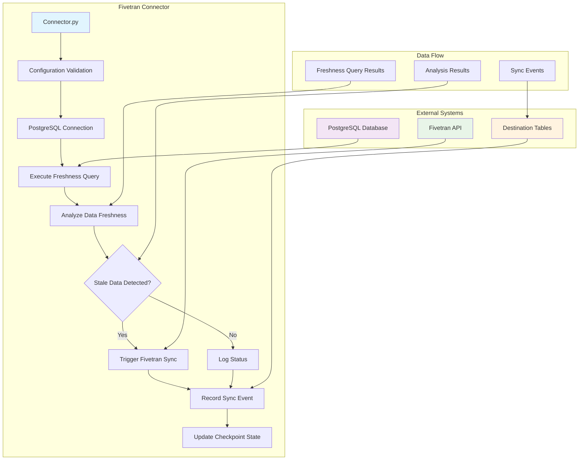

# Data Freshness Monitor and Fivetran Sync Trigger

This repository contains an example Fivetran connector that monitors data freshness in your source databases and automatically trigger Fivetran syncs when data becomes stale.

## Overview

The workflow:
1. Connect to a source database (PostgreSQL)
2. Execute a configurable data freshness query
3. Analyze the results to determine if data is stale
4. Automatically trigger a Fivetran connector sync if stale data is detected
5. Log all activities and sync events

## Architecture



## Connectors

### 1. PostgreSQL Connector (`connector.py`)
- **File**: `connector.py` - Main connector implementation
- **Purpose**: Monitors PostgreSQL data freshness and triggers Fivetran syncs
- **Key Features**:
  - Automatic connection management with error handling
  - Configurable freshness queries
  - Intelligent sync triggering based on stale data percentage
  - Comprehensive logging and state management
  - Fivetran API integration for sync operations

#### Core Functions in `connector.py`:

| Function | Purpose | Key Features |
|----------|---------|--------------|
| `validate_configuration()` | Validates all required config parameters | Ensures PostgreSQL and Fivetran credentials are present |
| `get_postgres_connection()` | Establishes database connection | Handles connection errors and port conversion |
| `execute_freshness_query()` | Runs the configured SQL query | Returns results as structured data with error handling |
| `analyze_freshness_data()` | Determines if sync is needed | Configurable threshold (default: 10% stale data) |
| `trigger_fivetran_sync()` | Triggers Fivetran connector sync | Unpauses connector and forces sync with retry logic |
| `update()` | Main execution workflow | Orchestrates entire monitoring process |

#### Configuration Parameters for `connector.py`:
```json
{
  "postgres_host": "your_postgres_host",
  "postgres_port": "5432",
  "postgres_database": "your_database", 
  "postgres_user": "your_username",
  "postgres_password": "your_password",
  "fivetran_api_key": "your_fivetran_api_key",
  "fivetran_api_secret": "your_fivetran_api_secret",
  "fivetran_connector_id": "your_connector_id",
  "freshness_query": "your_custom_freshness_query"
}
```

## Setup Instructions

### Prerequisites
- Python 3.7+
- Access to database (PostgreSQL for this demo)
- Fivetran API credentials
- Fivetran connector ID to monitor

### Installation

1. **Clone or download the connector files**
2. **Install dependencies:**
   ```bash
   
   # For PostgreSQL connector
   pip install -r requirements_postgres.txt
   ```

### Configuration

1. **Copy the appropriate configuration file:**
   - `configuration.json` for PostgreSQL

2. **Update the configuration with your values:**
   ```json
   {
     "postgres_host": "your_postgres_host",
     "postgres_port": 5432,
     "postgres_database": "your_database",
     "postgres_user": "your_username",
     "postgres_password": "your_password",
     "fivetran_api_key": "your_fivetran_api_key",
     "fivetran_api_secret": "your_fivetran_api_secret",
     "fivetran_connector_id": "your_connector_id",
     "freshness_query": "your_custom_freshness_query"
   }
   ```

### Database Setup

#### PostgreSQL Setup with Demo Data
1. **Run the setup script** (`setup_postgres.sql`):
   ```bash
   psql -U your_username -d your_database -f setup_postgres.sql
   ```

   The `setup_postgres.sql` file provides:
   - Complete database schema setup
   - Sample customer data with various freshness states
   - Helper functions for testing and monitoring
   - Indexes for optimal query performance
   - Views for easy freshness status checking

2. **Verify the setup:**
   ```sql
   -- Check test data
   SELECT * FROM customer_data ORDER BY last_update_time DESC;

   ```


## Usage

### Local Testing
```bash
# Test PostgreSQL connector
python connector.py

# The connector will use the configuration.json file and test against your PostgreSQL instance
```

### Fivetran Deployment
1. **Package the connector files**
2. **Deploy to Fivetran using the connector SDK**
3. **Configure the connector in Fivetran dashboard**

## Configuration Parameters

### Database Connection
- **PostgreSQL:** `postgres_host`, `postgres_port`, `postgres_database`, `postgres_user`, `postgres_password`

### Fivetran API
- `fivetran_api_key`: Your Fivetran API key
- `fivetran_api_secret`: Your Fivetran API secret
- `fivetran_connector_id`: ID of the connector to sync

### Monitoring
- `freshness_query`: SQL query that returns data with a `freshness_status` column

## Freshness Query Requirements

Your freshness query must return results with at least these columns:
- `company_id` (or similar identifier)
- `freshness_status` with values "Stale data" or "Fresh data"

## Output Tables

The connector creates two destination tables:

### 1. `data_freshness_monitor`
- Contains all records from the freshness query
- Includes metadata about sync decisions
- Primary key: `check_timestamp`, `company_id`

### 2. `sync_events`
- Tracks all sync trigger attempts
- Records success/failure status
- Primary key: `event_timestamp`, `connector_id`

## Customization

### Threshold Adjustment
Modify the stale data threshold in the `analyze_freshness_data` function in `connector.py`:
```python
# Currently set to 10% - adjust as needed
sync_needed = stale_percentage > 10
```

### Freshness Logic
Customize the freshness determination logic in your SQL query or modify the analysis function in `connector.py`.

## Demo and Testing
```sql
-- Create the customer_data table that will be monitored for freshness
CREATE TABLE IF NOT EXISTS customer_data (
    company_id SERIAL PRIMARY KEY,
    company_name VARCHAR(255) NOT NULL,
    last_update_time TIMESTAMP WITH TIME ZONE DEFAULT NOW(),
    active BOOLEAN DEFAULT true,
    data_source VARCHAR(100) DEFAULT 'postgresql',
    created_at TIMESTAMP WITH TIME ZONE DEFAULT NOW(),
    updated_at TIMESTAMP WITH TIME ZONE DEFAULT NOW()
);

-- Create an index on last_update_time for better query performance
CREATE INDEX IF NOT EXISTS idx_customer_data_last_update ON customer_data(last_update_time);
CREATE INDEX IF NOT EXISTS idx_customer_data_active ON customer_data(active);

-- Insert test data with various freshness states
INSERT INTO customer_data (company_name, last_update_time, active) VALUES
    ('Acme Corporation', NOW() - INTERVAL '2 hours', true),
    ('TechStart Inc', NOW() - INTERVAL '6 hours', true),
    ('Global Solutions', NOW() - INTERVAL '12 hours', true),
    ('Innovation Labs', NOW() - INTERVAL '18 hours', true),
    ('Data Dynamics', NOW() - INTERVAL '25 hours', true),  -- Stale data (>24 hours)
    ('Cloud Systems', NOW() - INTERVAL '30 hours', true),  -- Stale data (>24 hours)
    ('Digital Corp', NOW() - INTERVAL '36 hours', true),   -- Stale data (>24 hours)
    ('Smart Solutions', NOW() - INTERVAL '1 hour', true),
    ('Future Tech', NOW() - INTERVAL '8 hours', true),
    ('Enterprise Plus', NOW() - INTERVAL '15 hours', true);

-- Test the exact query that the connector will use
SELECT 
    company_id, 
    company_name, 
    last_update_time, 
    CASE 
        WHEN last_update_time < NOW() - INTERVAL '24 hours' 
        THEN 'Stale data' 
        ELSE 'Fresh data' 
    END as freshness_status 
FROM customer_data 
WHERE active = true
```

### Testing the Connector
```bash
# 1. Set up the database
psql -U your_username -d your_database -f setup_postgres.sql

# 2. Update configuration.json with your credentials

# 3. Test the connector
python connector.py

# 4. Check the results in your destination tables
```

## Troubleshooting

### Common Issues
1. **Connection failures:** Verify database credentials and network access
2. **Query errors:** Test your freshness query directly in the database
3. **API failures:** Verify Fivetran API credentials and connector ID
4. **Permission errors:** Ensure database user has appropriate SELECT permissions

### Logging
The connector provides detailed logging for debugging:
- Connection status
- Query execution results
- Analysis decisions
- API call results

### Debug Mode
The `connector.py` file includes a debug mode for local testing:
```python
if __name__ == "__main__":
    # Test the connector locally
    connector.debug(configuration=configuration)
```

## Support

For issues or questions:
1. Check the Fivetran connector SDK documentation
2. Verify your configuration parameters
3. Test database connectivity independently
4. Review Fivetran API documentation for authentication issues

## License

This connector is provided as-is for educational and development purposes. Please ensure compliance with your organization's policies and Fivetran's terms of service.
